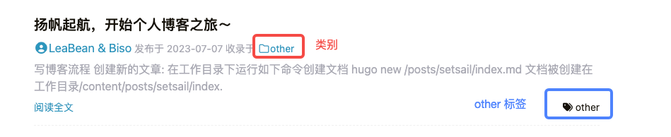
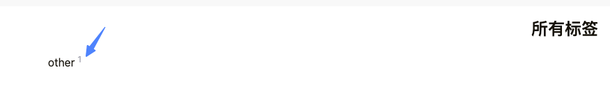
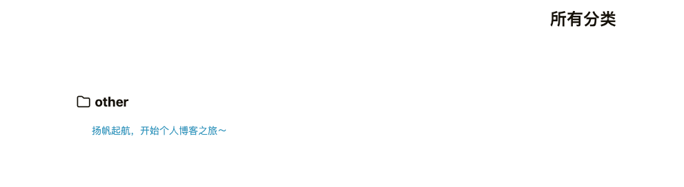
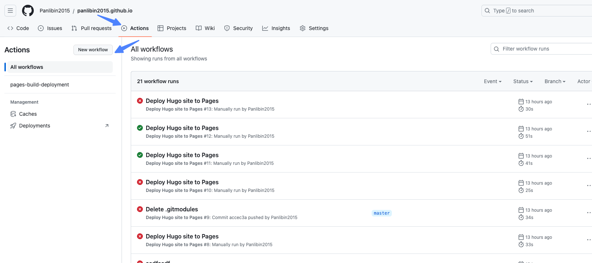
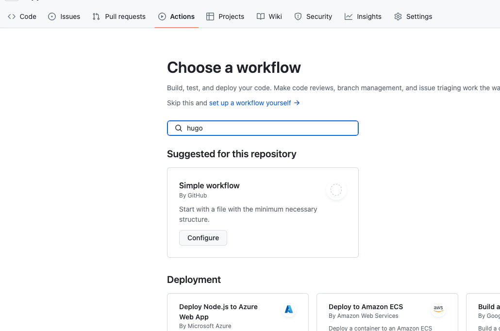
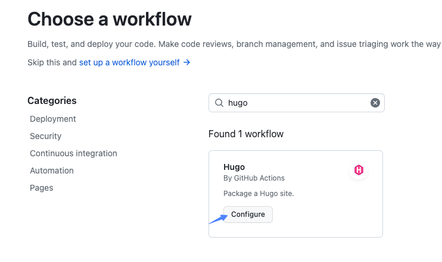
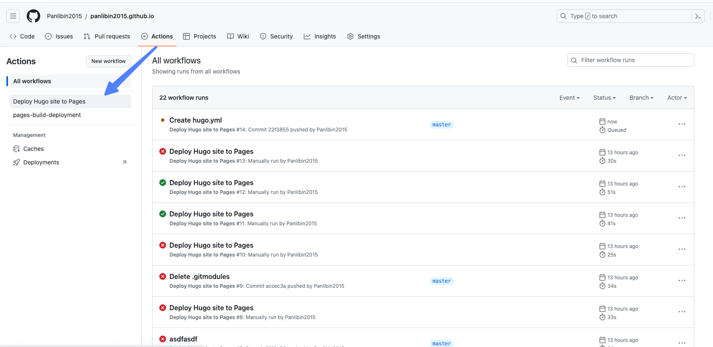

## 写博客流程
### 创建文档
首先要进入工作目录
```
    hugo new /posts/setsail/index.md
```

文档被创建在 **工作目录/content/posts/setsail/index.md**,文件内容如下:
```
    ---
    title: "扬帆起航～"
    date: 2023-07-07T15:56:13+08:00
    draft: true
    ---

```
生成的文件内容字段解释:
* title: 是文章标题
* date: 文章创建时间
* draft: 表示是否是草稿状态，草稿状态不会发布到站点。tip: **改为false或者删除发布**

其他常用属性:
* lastmod: 上次修改时间
* description: 文章描述
* **tags: 文章标签**
* **categories: 文章所属类别**


> ### 编辑文章内容: 操作如下

打开**工作目录/content/posts/setsail/index.md**，修改如下:
```
---
title: "扬帆起航，开始个人博客之旅～"
date: 2023-07-07T15:56:13+08:00
tags ["other"]
categories ["other"]
---

# 随便写点什么...
```
这里给这个文章打了个**标签**，并且分了**类别**，都是值都是**other**

> 本地启动，检查下^_^...
```
    hugo server
```

打开浏览器: http://localhost:1313/
主页:

标签页:

分类页:


### 推送到github构建
#### step1.创建workflows
进入提交的repository,选择 Actions, 点击New workflow 如下图:

#### step2.搜索hugo

#### step3.配置

#### step4.构建
